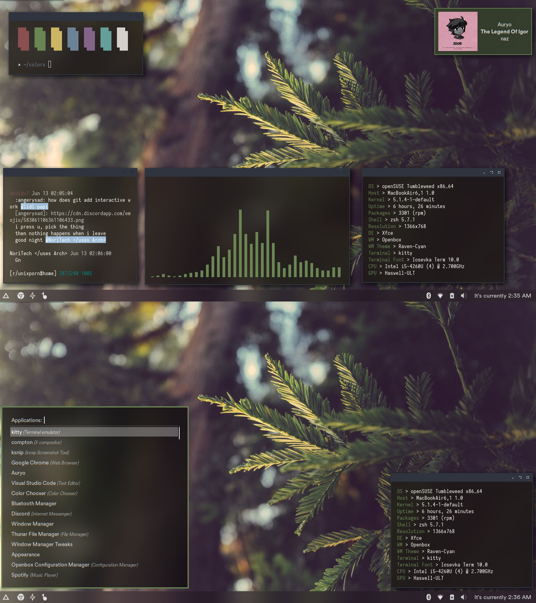
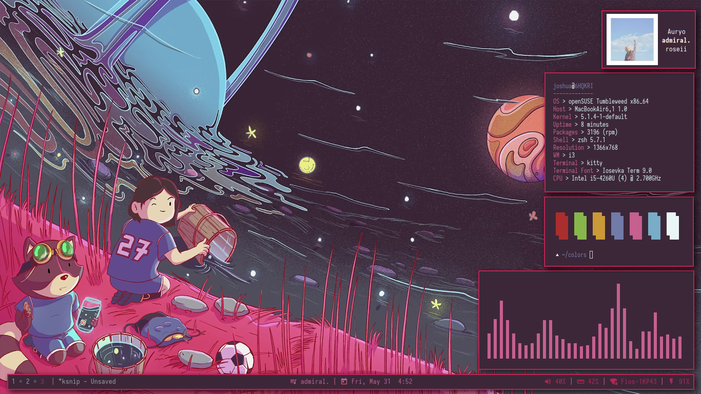
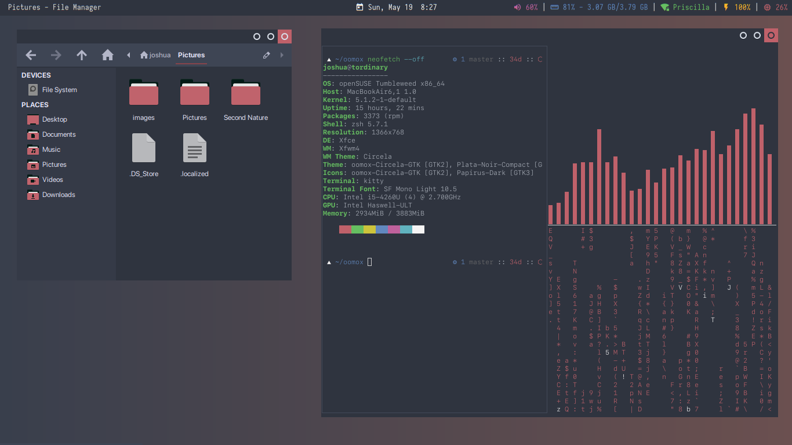
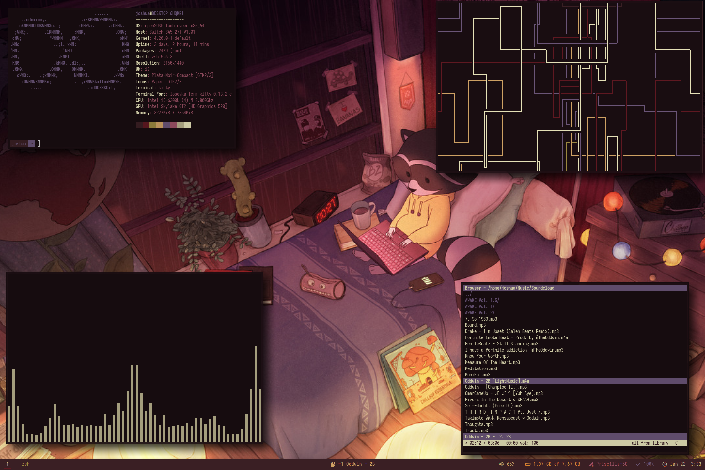

<h1 align="center">
  
   
 
</h1>
<h3 align="center">Dotfiles. Now organized.</h3>
 
 
### View [help.md](https://github.com/joshuah345/linux-dotfiles/blob/master/help.md) for info on how to use these files 
 

# Previews

## (NEW!!!) Forest Green
  
<b>NEW!!</b> [on r/unixporn](https://www.reddit.com/r/unixporn/comments/c02goe/xfce_forest_green_superuser1958/)

## Milky Waterway
  
 [on r/unixporn](https://www.reddit.com/r/unixporn/comments/bvcs2x/i3_milky_waterway_superuser1958/)

## Aenami-i3
  
[r/unixporn link](https://www.reddit.com/r/unixporn/comments/bt4dcp/i3_aenami_2/)

## Aenami-XFCE
  
[r/unixporn link](https://www.reddit.com/r/unixporn/comments/bsdmcl/xfce_aenami_superuser1958/)

## Circela/Sakuru
  
[r/unixporn link](https://www.reddit.com/r/unixporn/comments/bri3k2/xfcesakurusuperuser1958/)

## Cocoon
  

  
[r/unixporn link](https://www.reddit.com/r/unixporn/comments/aikwmk/i3_the_cocoon/)

