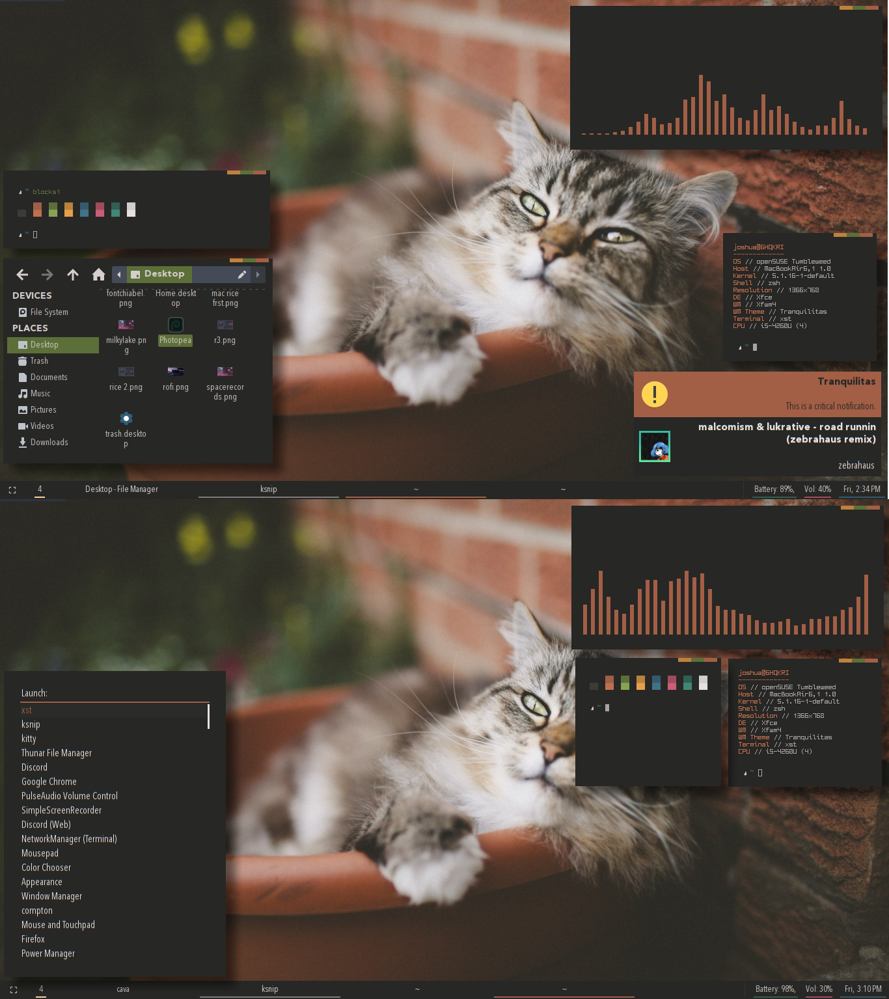
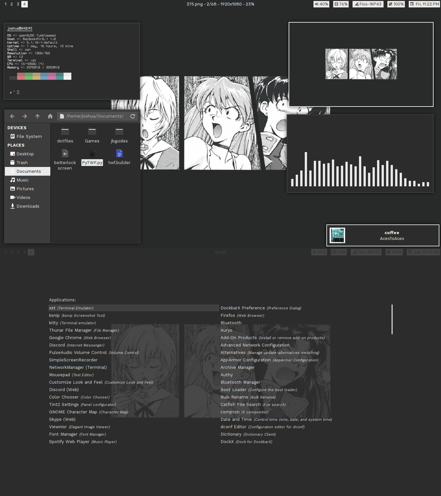
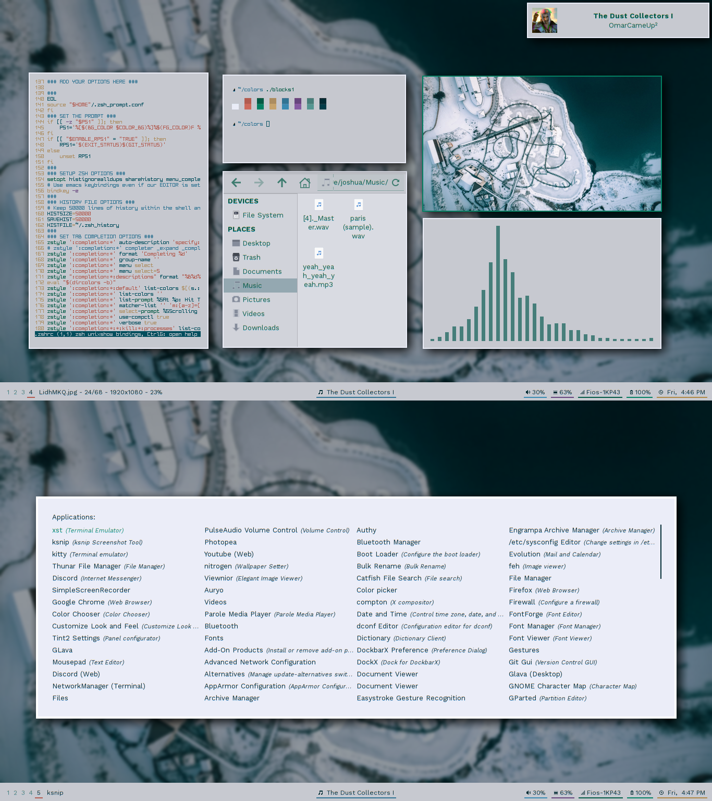
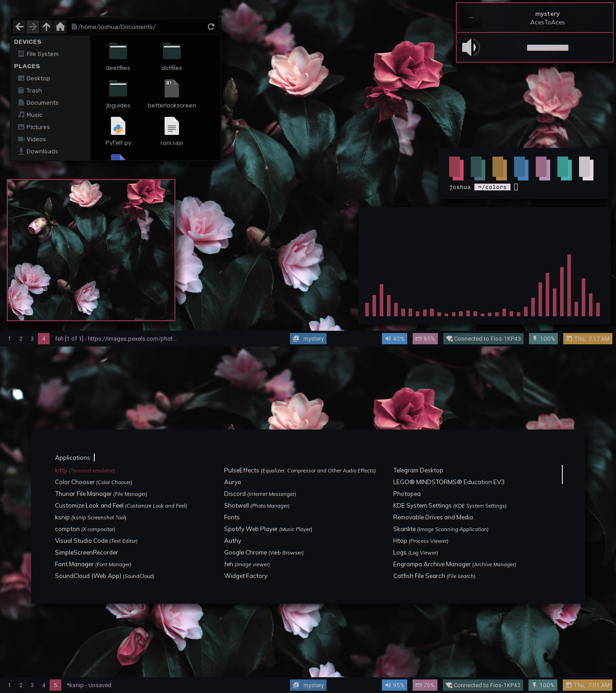
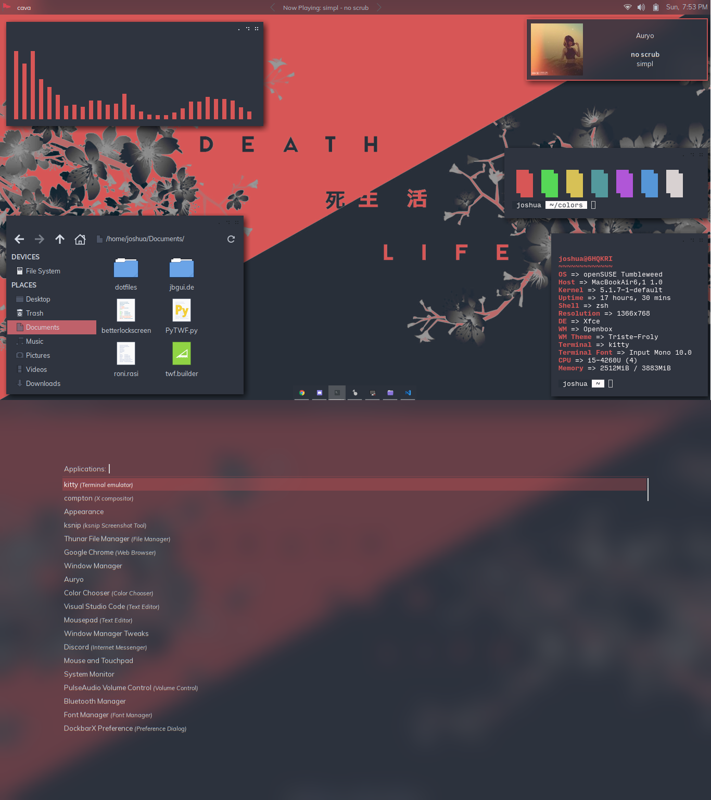
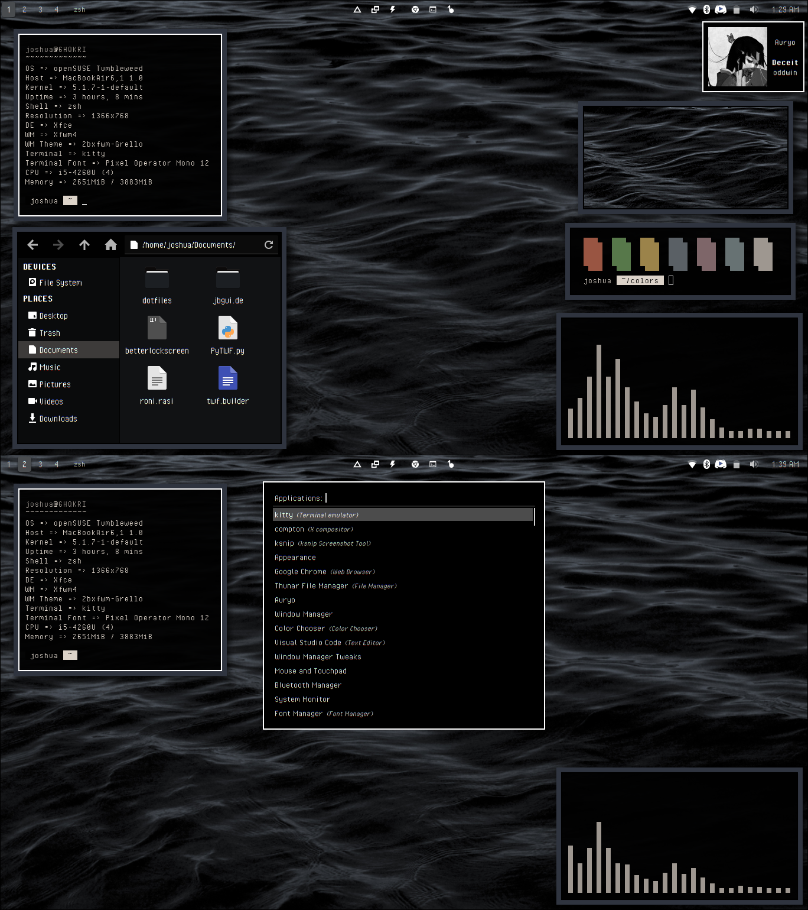

<h1 align="center">
  
   
 
</h1>
<h3 align="center">Dotfiles. Now organized.</h3>
 
 
### View [help.md](https://github.com/joshuah345/linux-dotfiles/blob/master/help.md) for info on how to use these files 
 

# Previews

## (new) Tranquilitas [XFCE, tint2]
  
[unixporn](https://www.reddit.com/r/unixporn/comments/ci7cud/xfce_tranquilitas/)

## Doujin [i3, polybar]
  
[on unixporn](https://www.reddit.com/r/unixporn/comments/cfmf5s/i3_doujin/)

## Rollercoaster [i3, polybar]
  
[on unixporn](https://www.reddit.com/r/unixporn/comments/cched1/i3_rollercoaster_superuser1958/)

## Rosebush [i3, polybar]
  
[on unixporn](https://www.reddit.com/r/unixporn/comments/c64h07/i3_rose_bushes_superuser1958/)

## (new!) Equal and Opposite [XFCE+Openbox, xfce4-panel]
 
[on unixporn](https://www.reddit.com/r/unixporn/comments/c4fy9v/xfceopenbox_equal_and_opposite_superuser1958/) - refer to [panel.md](https://github.com/joshuah345/linux-dotfiles/blob/master/Equal%20And%20Opposite%20(compton-tryone)/panel.md) for more info on how to remake these panels.

##  Limitless Ocean [XFCE, xfce4-panel]
 
 [on r/unixporn](https://www.reddit.com/r/unixporn/comments/c1ye26/xfce_limitless_ocean_superuser1958/)

## Forest Green [XFCE, xfce4-panel]
  
[on r/unixporn](https://www.reddit.com/r/unixporn/comments/c02goe/xfce_forest_green_superuser1958/)

## Milky Waterway [i3, polybar]
  
 [on r/unixporn](https://www.reddit.com/r/unixporn/comments/bvcs2x/i3_milky_waterway_superuser1958/)

## Aenami-i3 [i3, polybar]
  
[r/unixporn link](https://www.reddit.com/r/unixporn/comments/bt4dcp/i3_aenami_2/)

## Aenami-XFCE [xfce, polybar]
  
[r/unixporn link](https://www.reddit.com/r/unixporn/comments/bsdmcl/xfce_aenami_superuser1958/)

## Circela/Sakuru [xfce, polybar
  
[r/unixporn link](https://www.reddit.com/r/unixporn/comments/bri3k2/xfcesakurusuperuser1958/)

## Cocoon [i3, polybar]
  

  
[r/unixporn link](https://www.reddit.com/r/unixporn/comments/aikwmk/i3_the_cocoon/)

